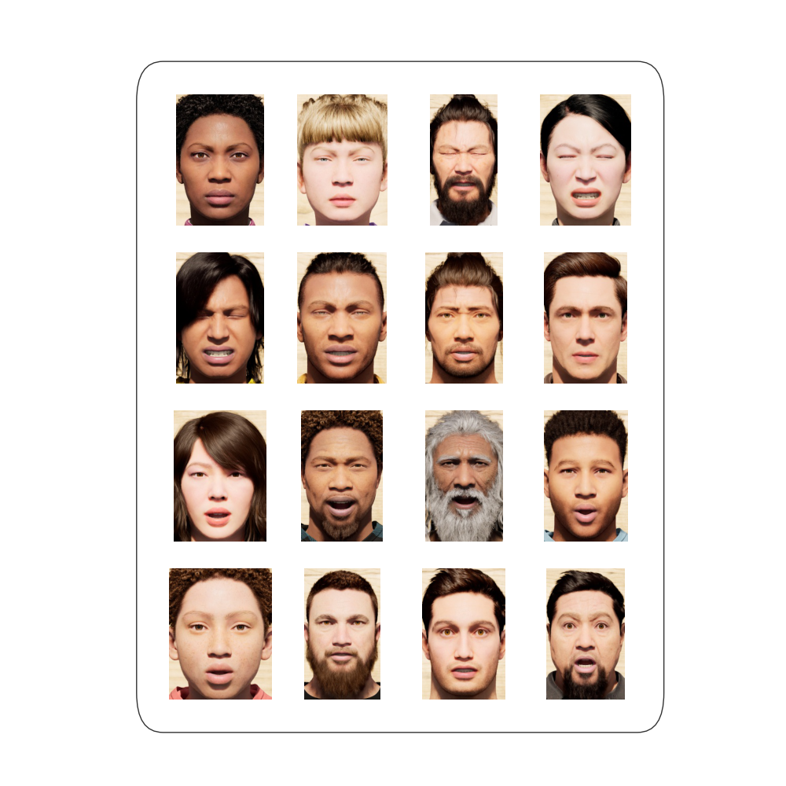
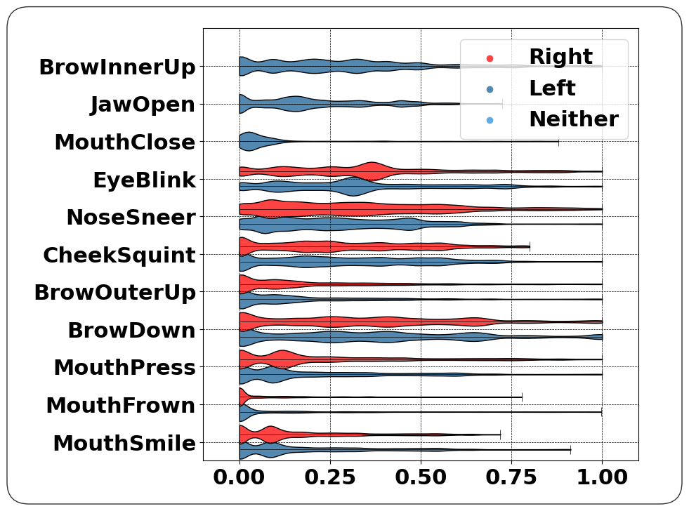

*Check back in early spring 2023 for details about the official challenge, model submissions, and leaderboard*

*Following completion of Spring 2023 challenge, FRST23.1, an extension of FRST will be released. Vote on the main focus of this extensions in this repositories [discussion](https://github.com/KelOdgSmile/FRST/discussions/3#discussion-4619686)*

# Facial Reasoning Synthesis Task 
This repository exists as the home of the FRST Dataset and Challenge Resources. FRST is a synthetic dataset for facial reasoning which includes simultaneous annotations for many tasks to encourage synthesis between task targets.

## Types of annotations 
 * Float representations of facial gesture actions. For instance smile, blink and sneer annotations
 * Emotion distributions for each image. For a given image, a set of normalized probabilities are given across emotions like Anger, Fear, and Sadness.
 * Head Pose, as a doublet of angular values. These values correspond to an actor looking up or down, left or right, and any combination of these.

 * Also provided are sets of triplets for similarity training with the FRST dataset. 

---

## Dataset Principles

Our aim is to produce a living dataset with progressively more exhaustive labels. Using high fidelity synthetic faces we can control and record every aspect of a given frame. In FRST, we chose to have a base sequence of 625 face configurations. For each of these we record the values of several components (Action Units/Gestures/...), as well as an estimate of the emotion being displayed. This base sequence is then replicated 10 times for each synthetic actor included in the dataset. All of these 10 duplicates are composed from typically 5 different head poses and 2 different lighting configurations.

## Past and Future Iterations

| Name | Release date | Link | Details |
| --- | --- | --- | --- |
| FRST22.4 | Winter 2022 | [link to here](https://github.com/KelOdgSmile/FRST) | Original Data with 60 Actors, Simple poses and lighting|
| FRST23.1 | Spring 2023 | NA | Extension of FRST22.4 to new task, new data|
| ... | ... | ... | ... |

---
## Current Annotations

### Gestures: ###
The keys for all gestures are a subset of those keys used in ARKit, but while they are approximately the same, the scale of these values is not one to one. From the plot of the distributions, it is obvious that the distributions are not uniform between 0, and 1. This is deliberate and no rescaling has been performed as most real faces in everyday life sit in very low values of each of these gestures. Future datasets will exagerate all of these features and produce "nonrealisitc/inhuman/imaginary" faces to expand the bounds of the feature space learned by the models. For this iteration of FRST, most faces are highly realistic, if not just a little unusual.

 * Mouth
   * JawOpen
   * MouthClose
   * MouthPress
   * MouthFrown
   * MouthSmile
* Eye & Eyebrow
  * EyeBlink
  * BrowOuterUp
  * BrowDown
  * BrowInnerUp
* Cheek and Nose
  * NoseSneer
  * CheekSquint

---

### Emotions: ###

The available emotion distributions are composed of the 7 emotion modes previously used in FER/FER+ as well as many other datasets.

* Anger
* Disgust
* Fear
* Neutral
* Joy
* Sadness
* Surprise
For any given frame, the 

---
### Train Test Split
The suggested split for this dataset is between actors. Of the all 60 actors, 6 are kept as validation, 6 as testing, which leaves 488888888 actors for training. This data split is chosen because of the presence of very similar frames for any given actor. If even non-identical frames from an actor were present in training and test data this would result in an inflated test accuracy.

---
## Dataset Layout
There are two downloads for FRST22.4. One contains all of the images, totaling about 7 Gbs. Each image name is organized as FRST_{actor_name}.{frame number #5digits}.jpg
Once unzipped the image directory is organized as FRST->Group#->images or 

     FRST
          ---->Group1
               ---->FRST_Ada.00000.jpg 
               ---->FRST_Ada.00001.jpg
               ...
               ...
          ---->Group2
               ---->FRST_Emanuel.00000.jpg
               ...
          ...

---
The organization of annotations takes several dataframes, but is largely straightforward and easy to use.
### ActorsKey.csv
This contains a list of includes actors, their respective headpose dataframe, whether they belong to the train set, test set, or validation set, and any missing frames if applicable.
For instance

| actor | headpose | traintestval | bad_frames|
| --- | --- | --- | --- |
| Ada | 0 | train | [] |
| Amelia | 0 | train | [] |
| ... | ... | ... | ... |

### HeadPoseAnnotations_n.csv
 
These dataframes are what are reference in the ActorsKey dataframe, where n is equal to the relative headpose value in the ActorsKey dataframe. From above we see that the actor Adas headpose are given by HeadPoseAnnotations_0.csv .
Each index of this dataframe corresponds to the frame number of an actor. For instance headpose.iloc[51] holds the annotations for FRST_Actor.00051.jpg and so forth.
The headpose is given as two degrees corresponding to head_yaw and head_pitch.
| head_yaw | head_pitch|
| --- | --- |
| 0 | 0 |
| 0.01 | 0 |
| 0.02 | 0 |
| ... | ... |

### FRSTAnnotations.csv

This is the largest dataframe containing annotations for the gestures and emotions detailed above. As with the headposes above, the index of this dataframe corresponds with the frame which the row annotates.

## Download Links

|  File  |  Link  |  Size  |
| --- | --- | --- |
| Images | [drive]( https://drive.google.com/file/d/1YcEHfZ-n7Ifvx9NoLIgiEwwog3n63puW/view?usp=sharing ) | 7 Gb |
| Training Dataframes | [drive](https://drive.google.com/file/d/1dX28L0Uvb-TQEkwC8RZOTPvm-Ra5vd0j/view?usp=sharing ) | 0.5 Mb |
| Triplet Dataframes | soon to be released | 5 Mb|

